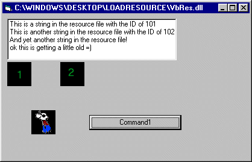



## Use a Vb DLL as a RESOURCE DLL that your apps can \*easily\* link to\!

### Description

do you want your program to have a skin? do you want your program to be a mulit-language app? Do you want to learn how to make any EXE, DLL or OCX into a resource library? This code shows you how.

This will show you how to load any EXE, DLL or OCX and IMPORT the Bitmaps and Strings to your APP!

Very easy to use =)
 
### More Info
 
Fun stuff

none (i hope)

             |
---                |---
**Submitted On**   |2000-09-26 12:51:56
**By**             |[Andrew Heinlein \(Mouse\)](https://github.com/Planet-Source-Code/PSCIndex/blob/master/ByAuthor/andrew-heinlein-mouse.md)
**Level**          |Intermediate
**User Rating**    |4.9 (59 globes from 12 users)
**Compatibility**  |VB 6\.0
**Category**       |[Windows API Call/ Explanation](https://github.com/Planet-Source-Code/PSCIndex/blob/master/ByCategory/windows-api-call-explanation__1-39.md)
**World**          |[Visual Basic](https://github.com/Planet-Source-Code/PSCIndex/blob/master/ByWorld/visual-basic.md)
**Archive File**   |[CODE\_UPLOAD101769262000\.zip](https://github.com/Planet-Source-Code/andrew-heinlein-mouse-use-a-vb-dll-as-a-resource-dll-that-your-apps-can-easily-link-to__1-11683/archive/master.zip)

